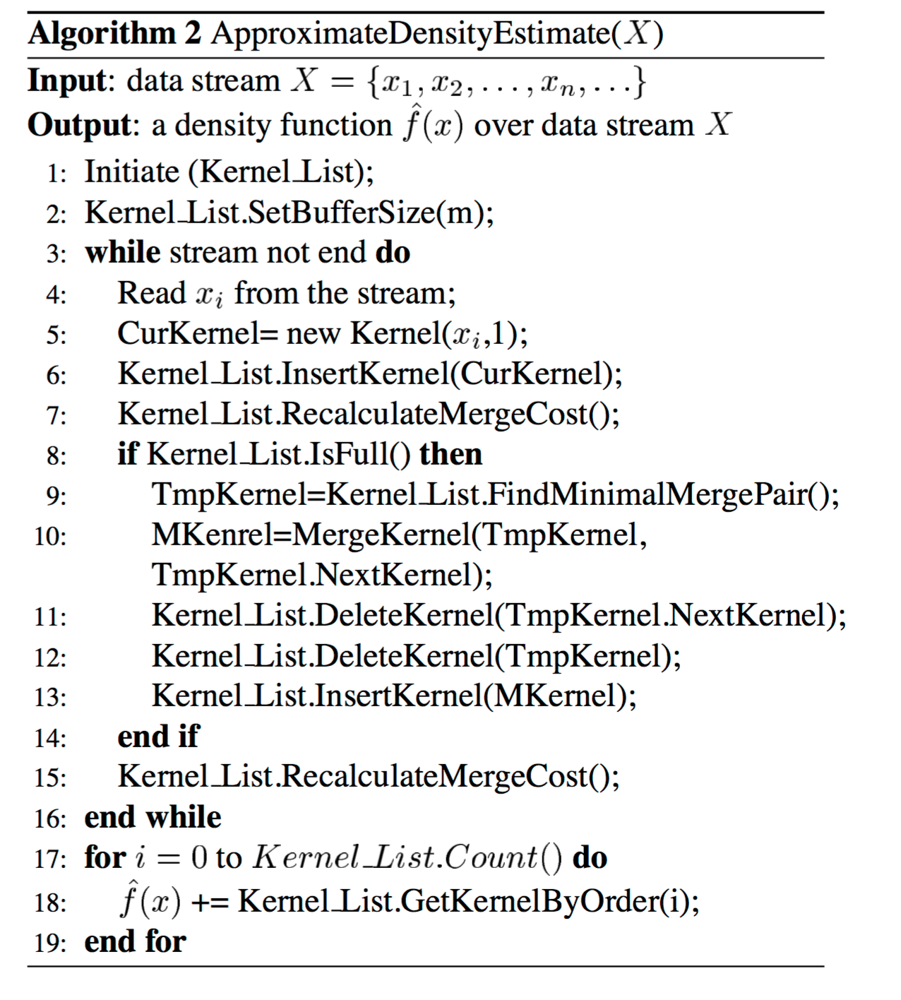
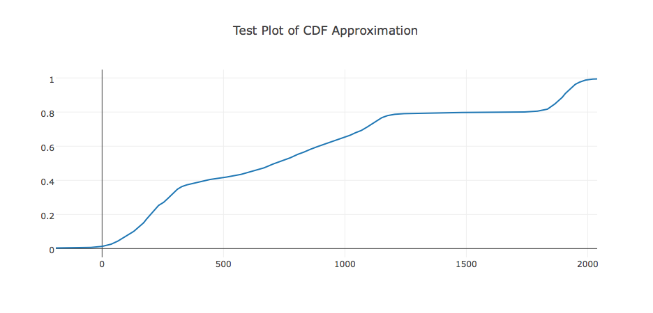
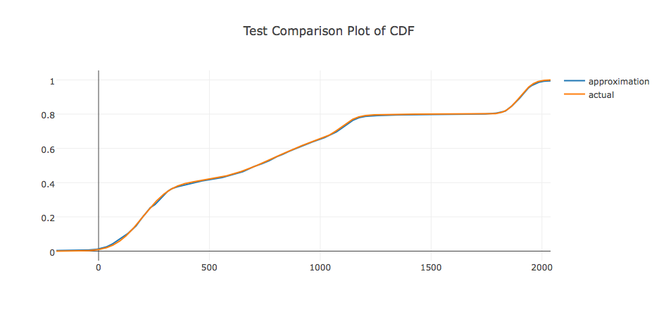

# StreamingKDE
This repository provides an implementation of a streaming kernel density estimation algorithm in Scala outlined [here.](http://alumni.cs.ucr.edu/~wli/publications/deosd.pdf)  I created this repository as part of my final project for my course in advanced statistics at Galvanize University.


--------------------------
## Table of Contents

- [Introduction](#section1)
- [Intuition](#section2)
- [Implementation](#section7)
    * [Kernel](#Kernel)
    * [KernelGenerator](#KernelGenerator)
    * [KernelMap](#KernelMap)
    * [KernelPlot](#KernelPlot)
- [How to](#section3)
    * [create an instance of KernelMap](#ht1)
    * [use KernelMap with a stream](#ht2)
    * [approximate a stream](#ht3)
    * [get a cdf/pdf value from the approximation](#ht4)
    * [get the frequency of a value](#ht5)
    * [plot the approximated cdf/pdf](#ht6)
    * [plot a comparison between the actual and approximated cdf/pdf](#ht7)
    * [more examples](#ht8)
- [Future Work](#section4)
- [Conclusion](#section5)
- [References](#section6)


--------------------------
<a id='section1'></a>
## Introduction
The goal of my project is to provide a scalable way to approximate the distribution of a stream of data.  Through providing an approximation of the distribution of the stream hopefully data scientists will be able to better model the stream and/or know how to best include the streaming data in models.  Additionally, the distribution can be used as a first order approximation for anomaly detection.  


Histograms and kernel density estimation are the two default methods for modeling a distribution for a set of data.  Histograms provide a simple but effective way of giving insight to a set of data's distribution, but they force a discrete view of the distribution and can only provide quantile estimates for observations.  Kernel density estimation, although slightly more complex than histograms, provide a continuous view of our distribution and allow us to construct approximate CDF values for observations.  I have chosen kernel density estimation for this project because I wanted to provide a continuous view of the distribution, but along the way I discovered why, for the time being, histograms should be preferred over kernel density estimation for large data (Hint: It has to do with associativity.  See [Future Work](#section4) for more details).


The rest of this paper will proceed with first laying out the [Intuition](#section2) of algorithm used to calculate the streaming kernel density estimation, and then cover the [Implementation](#section7) of the algorithm.  Then I will cover how to use this library in the [How to](#section3) section.  The paper will then cover the [Future Work](#section4) laid out for this project, and finally some closing thoughts will be presented in the [Conclusion.](#section5)

--------------------------
<a id='section2'></a>
## Intuition
The easiest way to understand the streaming kernel density algorithm is to consider its discrete analog the histogram.  A streaming histogram algorithm has n buckets that each value of the stream will be placed into.  Each of the n buckets represents a subset of the potential values any item in the stream could be and the bucket only contains how many elements have been placed in the bucket.  When a new value is pumped out of the stream we find the correct bucket to place the value and increment that bucket's count by one.  

What if instead of a bucket just containing the count of items in the bucket, the bucket contained an approximation of the first and second moment of all the values that have placed in that bucket? Now when a value is pumped out of the stream we find the correct bucket to place the value, increment the bucket's count by one, add the value to a running sum, and square the value and add that to another running sum.  Each bucket now is able to approximate E(X) and E(X^2) meaning each bucket is able to approximate the mean(E(X)) and variance(E(X^2) - E(X)^2) of all the data it contains.  When we move from buckets containing just counts to buckets containing counts, sum of values and sum of squared values, we transition from histograms to kernel density estimation.  With each bucket now containing the first and second moment approximations for all the data it contains we can have each bucket represent a Gaussian since we have estimates for its two parameters.  We can now think instead of having n buckets we have n Gaussians. Each Gaussian can be weighted proportion of all the values used to generate it to create a weighted CDF and weighted PDF for a specific value, which allows us to generate the continuous view of the stream's distribution [(Zhou).](http://alumni.cs.ucr.edu/~wli/publications/deosd.pdf)

Now that we know a streaming kernel density algorithm is just the composition of n Gaussians, where each Gaussian represents a different subset of values the stream can pump out, we must consider the case when we have observed less than n distinct values and the case where have observed more than n distinct values in our stream.

When there are less than n distinct values observed and we receive a new value we have either already seen the value or it is an unseen value.  If the new value is something we have already seen we simply find the Gaussian made for this value update its count, first moment and second moment and continue with the next value in the stream.  If the new value has not been seen before we simply create a new Gaussian for it since less than n distinct values observed, which means less than n Gaussians have been generated.  For this new Gaussian we initialize its count is initialized to one, its first moment is initialized to the value and its second moment is initialized to the square of the value.

Similarly, when there are more than n distinct and we receive a new value we have either already seen the value or it is an unseen value.  If the new value is something we have already seen, we treat it the same way we did in the case where we observed less than n distinct values.  In the case where the new value is unseen we first generate its own Gaussian the same we did when we observed less than n distinct values, but now we have n+1 Gaussians.  To get back to n Gaussians we sort the n+1 Gaussians by their means and calculate the cost of merging each neighboring pair of Gaussians as described in this [paper.](http://alumni.cs.ucr.edu/~wli/publications/deosd.pdf)  Merge cost, in this context, proxies for the information lost in our distribution approximation by merging the given pair of Gaussians.  Whichever pair has the smallest merge cost we replace those two Gaussians with a new Gaussian that merges the two's count, first moment and second moment [(Zhou).](http://alumni.cs.ucr.edu/~wli/publications/deosd.pdf) 

--------------------------
<a id='section7'></a>
## Implementation
The streaming kernel density estimation algorithm is outlined in the paper as follows:

[source: Zhou](http://alumni.cs.ucr.edu/~wli/publications/deosd.pdf)

In my implementation of the streaming kernel density estimation I have divided my concerns into modeling the individual kernel(aka Gaussian) and having a separate implementation for the data structure which holds the n kernels(aka Gaussians).
<a id='Kernel'></a>
### Kernel
[Kernel](StreamKDE/src/main/scala/Kernel.scala) is a data type made to represent an individual Gaussian.  The Kernel is made up of an approximation of the first moment, an approximation of the second moment, an approximation of the count of each value used to generate this Kernel rounded to its nearest Long(there is no count min sketch monoid for Double so I went with the next best thing), and the merge cost between this Kernel and the next Kernel with the next largest mean less than this Kernel's mean.  My implementation of kernel encapsulates kernel functionality and interactions with other kernels including merging kernels, calculating merge cost between kernels, calculating the cdf for a given value, calculating the pdf for a given value, amoung other things([see the implementation for all of Kernel's methods](StreamKDE/src/main/scala/Kernel.scala)).
<a id='KernelGenerator'></a>
### KernelGenerator
[KernelGenerator](StreamKDE/src/main/scala/KernelGenerator.scala) provides a way for a double to be automatically wrapped in an instance of Kernel and ensures that all kernel instances have their count min sketch initialized the same way.
<a id='KernelMap'></a>
### KernelMap
[KernelMap](StreamKDE/src/main/scala/KernelMap.scala) composes Kernels to form an implementation of the streaming kernel density estimation algorithm.  KernelMap is made of a sorted map where the values are the kernels, the keys are the means for the kernels and the map is sorted by key and a size parameter which sets the maximum number of Kernels we can use to approximate the distribution.  KernelMap encapsulates the update procedure for new values in the stream being added to our approximation of the distribution, allows for us to generate a cdf and a pdf for a value based on our approximated distribution, amoung other things([see the implementation for all of KernelMap's methods](StreamKDE/src/main/scala/KernelMap.scala)).

It is important to note that KernelMap also keeps track of the variance for all values observed in the stream.  This variance is passed to all kernels in the KernelMap and will be used by a kernel if the kernel's variance is below a certain threshold to prevent overflow.
<a id='KernelPlot'></a>
### KernelPlot
[KernelPlot](StreamKDE/src/main/scala/KernelPlot.scala) is a way to plot the approximated cdf or pdf generated by your instance of KernelMap using [plotly](https://plot.ly/scala/getting-started/).  Also this class allows you to draw comparison plots between KernelMap's approximated pdf/cdf and the actual pdf/cdf(assuming the true distribution is known).

NOTE: You must have a plotly account to use this class([see here](https://plot.ly/scala/getting-started/)).

--------------------------
<a id='section3'></a>
## How to
This section lays out how to use some of the key features of the library.  This section should inform you how to set up a KernelMap, how to incorporate the KernelMap with a stream, what you can do with the approximated distribution generated by the KernelMap and how to plot the resulting approximated cdf/pdf generated by the KernelMap.

To follow along with this "How to" download this repo go to the [StreamKDE folder](StreamKDE/) in your terminal and type the following:

```scala
> sbt console

Welcome to Scala 2.11.8 (Java HotSpot(TM) 64-Bit Server VM, Java 1.8.0_65).
Type in expressions for evaluation. Or try :help.

scala> import com.jwb.streamKDE.KernelMap
import com.jwb.streamKDE.KernelMap

scala> import com.jwb.streamKDE.KernelPlot
import com.jwb.streamKDE.KernelPlot
```
Now we have the two classes imported that are necessary to complete the rest of this "How to".
<a id='ht1'></a>
### create an instance of KernelMap
To create an instance of KernelMap we initialize a new KernelMap just like we would for any other class.  For alternative constructors please see the [implementation of KernelMap.](StreamKDE/src/main/scala/KernelMap.scala)
```scala
scala> val kernelMap = new KernelMap()
kernelMap: com.jwb.streamKDE.KernelMap = com.jwb.streamKDE.KernelMap@46c5f74c
```
Note that this is the identity of KernelMap, if only we had [associativity.](#section4)
<a id='ht2'></a>
### use KernelMap with a stream
The below code snippet shows how to use a KernelMap with a stream.  All you need is a data type with an instance of Foldable that contains numeric data and an instance of KernelMap.  You simply use your KernelMap instance as the identity element for your fold and add each numeric value to the instance of KernelMap.  At the end of the fold you will be returned an instance of KernelMap that approximates the distribution for all the data that has been added to it.
```scala
scala> val testStream = 1 to 10000 
testStream: scala.collection.immutable.Range.Inclusive = Range(1, 2, 3,...
scala> val kMapTest = testStream.foldLeft(kernelMap)(_+_)
kMapTest: com.jwb.streamKDE.KernelMap = com.jwb.streamKDE.KernelMap@b2050c9
```
<a id='ht3'></a>
### approximate a stream
To test the KernelMap with a known distribution I have created a static method for KernelMap called approx.  You simply pass the distribution you would like to randomly draw from and the number of draws you want made and an instance of KernelMap that approximates the distribution for the drawn values will be returned.

For this "How to" I decided to approximate .4*Gaussian(200,100) + .3*Gaussian(800,200) + .2*Gaussian(1900,50) + .1*Gaussian(1100, 50).  So all the following code is based off of an approximation of this distribution.  I have used another static method in KernelMap called multipleGaussian to help me generate the distribution's corresponding random draw function, its cdf and its pdf.
```scala
scala> val arr = Array((200.0,100.0,.4), (800.0,200.0,.3), (1900.0,50.0,.2), (1100.0, 50.0, .1))
arr: Array[(Double, Double, Double)] = Array((200.0,100.0,0.4), (800.0,200.0,0.3), (1900.0,50.0,0.2), (1100.0,50.0,0.1))

scala> val (mgDraw, mgCdf, mgPdf)= KernelMap.multipleGaussian(arr)
mgDraw: () => Double = <function0>
mgCdf: Double => Double = <function1>
mgPdf: Double => Double = <function1>

scala> val mgApprox= KernelMap.approx(mgDraw, 100000)
mgApprox: com.jwb.streamKDE.KernelMap = com.jwb.streamKDE.KernelMap@2c04c822
```
<a id='ht4'></a>
### get a cdf/pdf value from the approximation
To get the cdf or pdf value from your KernelMap simply call your KernelMap instance's cdf or pdf method and pass it the corresponding value that you would like to find the cdf or pdf for.

I have also called the cdf for the actual distribution so you can see how well our approximation did.
```scala
scala> mgApprox.cdf(200.0)//approximation
res1: Double = 0.2005548209684771

scala> mgCdf(200.0)//actual
res2: Double = 0.20040496940948904
```
<a id='ht5'></a>
### get the frequency of a value
To get the frequency of a value from your KernelMap simply call your KernelMap instance's frequency method and pass it the corresponding Long that you would like to find the frequency for.
```scala
scala> mgApprox.frequency(200)
res3: Long = 78
```
<a id='ht6'></a>
### plot the approximated cdf/pdf
To generate a plot of your approximated cdf or pdf you must create an instance of KernelPlot and pass your KernelMap.  Then you must call your KernelPlot instance's drawCdf or drawPdf method and then your plot will be generated and posted under the files section of your Plotly account.
```scala
scala> val kp = new KernelPlot(mgApprox, 2000)
kp: com.jwb.streamKDE.KernelPlot = com.jwb.streamKDE.KernelPlot@e4ace7f

scala> kp.drawCdf("approximation","Test Plot of CDF Approximation")
res9: Option[co.theasi.plotly.writer.PlotFile] = Some(PlotFile(...,Test Plot of CDF Approximation))
```


<a id='ht7'></a>
### plot a comparison between the actual and approximated cdf/pdf
To generate a comparison plot between the actual and approximated cdf or pdf you must create an instance of KernelPlot and pass your KernelMap.  Then you must call your KernelPlot instance's drawComparisonCdf or drawComparisonPdf method and then your plot will be generated and posted under the files section of your Plotly account.
```scala
scala> kp.drawComparisonCdf(mgCdf, "actual", "approximation", "Test Comparison Plot of CDF")
res6: Option[co.theasi.plotly.writer.PlotFile] = Some(PlotFile(...,Test Comparison Plot of CDF))
```


<a id='ht8'></a>
### more examples

If you would like to see more examples of this library being used look at the [test suite](StreamKDE/src/test/scala/)

--------------------------
<a id='section4'></a>
## Future Work
First, I believe the merge algorithm needs to be changed so that it will be associative.  In its currents format the merge algorithm is not associative.  Without the merge being associative, KernelMap does not form a monoid, meaning we cannot parallelize the operation, which prevents it from being a scalable solution.  The lack of associativity most likely explains why streaming kernel density estimation is not nearly as used as histogram approximations which can be formed as a monoid and is therefore scalable.

Once figuring out an associative merge operation I would like to implement the algorithm using possibly Akka or Spark Streaming.

--------------------------
<a id='section5'></a>
## Conclusion
Streaming kernel density estimation is just the composition of n Gaussians, where each Gaussian represents a different subset of values the stream can pump out.  In its current format streaming kernel density estimation lacks an associative merge operation, which prevents it from being a truly scalable solution.  Once an associative merge operation is adopted, the streaming kernel density estimation will form a monoid allowing it to scalably approximate a distribution.

--------------------------
<a id='section6'></a>
## References
[Zhou A, Cai Z, Wei L (2015) Density estimation over data stream](http://alumni.cs.ucr.edu/~wli/publications/deosd.pdf)